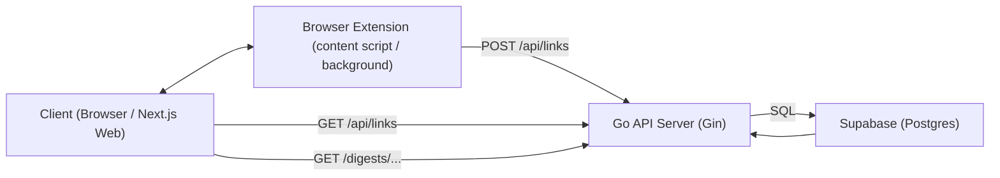
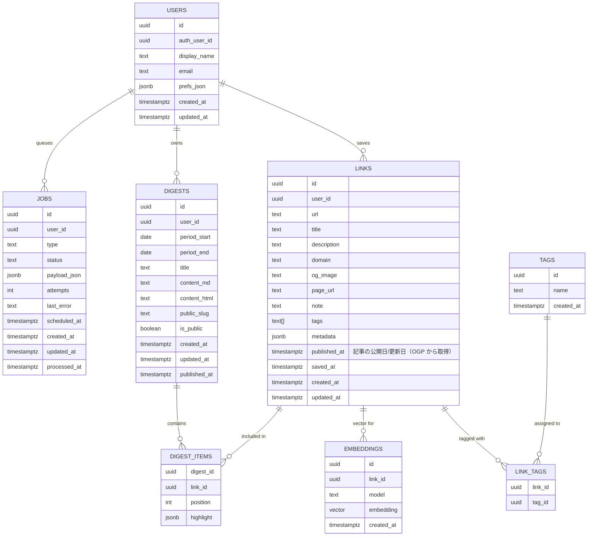

# アーキテクチャ概要

- **目的**

  - 気になった Web ページの URL を「ブラウザ拡張から一瞬で保存」して、あとから Web ダッシュボードで見返したり、将来は週次・月次ダイジェストにまとめられるようにする。
  - サーバーサイドは Go（Gin）、フロントは Next.js、データは Supabase/Postgres に集約する。

## 主要コンポーネント

| コンポーネント | ディレクトリ | 技術                |
| -------------- | ------------ | ------------------- |
| ブラウザ拡張   | /extension   | Chrome Manifest V3  |
| API サーバー   | /api         | Go + Gin            |
| Web アプリ     | /web         | Next.js             |
| データベース   |              | Supabase / Postgres |

## コンポーネント構成

- **ブラウザ拡張（extension）**

  - スマホ：content script がページ上でリンクの「長押し」を検出し、小さな `Save` ボタンを表示。
  - PC：リンクの右クリックメニューに「Save link to QuickLinks（仮）」などのコンテキストメニュー項目を追加。
  - 上記いずれかの操作で以下のペイロードを API に送信：
    - `url`: 保存対象のリンク URL
    - `title`: リンクテキスト or ページタイトル
    - `page`: 保存操作をしたページの URL
    - `note`: 将来用に、選択テキスト等を載せられる余地
  - 拡張はローカルに保存している Clerk の JWT を使って、`fetch("{API_BASE}/api/links")` に JSON を POST。
  - HTTP ヘッダ `Authorization: Bearer <JWT>` を付与して認可を通す（共有シークレット方式は廃止）。
  - Clerk の JWT は QuickLinks Web アプリへのログイン時に同期される。Web 側が `window.postMessage` でトークンをブラウザに投げ、拡張の content script → background がそれを受け取って `chrome.storage.sync` に保存する。

- **API サーバー（api, Go + Gin）**

  - エンドポイント：
    - `POST /api/links`
      - 拡張からのリンク保存リクエストを受け取る。
      - リクエストヘッダの `Authorization: Bearer <Clerk JWT>` を検証し、トークンが無効または不足している場合は `401 Unauthorized` を返す。
      - JWT の `sub` から `user_id` を取得し、そのユーザーのリンクとして保存する。
      - リクエストボディ（`url`, `title`, `note`, `page`, `user_identifier`）をバリデーション。
      - `url` から簡易的に `domain` を抽出。
      - OGP 情報（タイトル、Description、OG Image、公開日/更新日）を自動取得して DB に保存（M3 で実装済み、ただし表示時は `/api/og` でリアルタイム取得も可能）。
      - `links` テーブルに 1 レコード挿入し、生成された `id` を返す。
    - `GET /api/links`
      - Web アプリ向けのリンク一覧取得 API。
      - Clerk の JWT トークンで認証し、認証済みユーザーのリンクのみ返却。
      - クエリパラメータ（`limit`, `from`, `to`, `domain`, `tag` など）でフィルタリング可能。
      - ソート順: `ORDER BY COALESCE(published_at, saved_at) DESC`（公開日を優先、なければ保存日で降順）。
    - `GET /api/og`
      - OGP 情報（タイトル、Description、OG Image、公開日/更新日）を取得する API。
      - クエリパラメータ `url` を受け取り、そのページのメタデータを返却。
      - レスポンス: `{ title, description, image, date }`（`date` は `published_at` 相当の日付文字列、取得できない場合は `null`）。
      - Clerk の JWT トークンで認証。
      - `internal/service/metadata.go` の `FetchMetadata` 関数を使用してスクレイピング。
  - 構成イメージ：
    - `internal/config` … 環境変数（`PORT`, `DATABASE_URL`, `SHARED_SECRET`）の読み込み。
    - `internal/db` … Postgres（ローカル）または Supabase への接続プール管理、`InsertLink` などの簡易 DAO。
    - `internal/model` … `LinkCreateRequest` などのリクエスト / モデル定義。
    - `internal/handler` … Gin のハンドラ群（`CreateLink`, `GetLinks`, `GetOGP` など）。
    - `internal/service` … ビジネスロジック（`FetchMetadata` など、OGP 取得処理）。
    - `cmd/server/main.go` … HTTP サーバー起動、Graceful Shutdown。

- **Web アプリ（web, Next.js）**

  - 役割：
    - 保存されたリンクの一覧表示（ダッシュボード）。
    - 日付範囲 / ドメイン / タグなどによるフィルタ（段階的に追加）。
    - 将来的には、週次・月次ダイジェストの閲覧や共有ページのレンダリングもここで担当。
  - データ取得方法：
    - **Next.js API Route 経由**: `/api/links` と `/api/og` ルートを作成し、Go API へのプロキシとして機能。
      - クライアント（useSWR）からは `/api/links` と `/api/og` を叩く。
      - Next.js API Route がサーバーサイドで Clerk の `auth()` から取得した JWT を `Authorization: Bearer <JWT>` として Go API に転送する。
      - **理由**: ブラウザからは Clerk とのセッションだけを扱い、Go API の認証情報を直接クライアントに露出させないため（全公開予定のためセキュリティが重要）。
    - **useSWR によるキャッシュ**: クライアントサイドでデータをキャッシュし、30 秒ごとに自動更新。
    - **OGP 情報の表示**: サムネイル画像、Description、公開日/更新日を表示（M3 で実装済み）。
      - 表示時に Go API の `/api/og` を呼び出してリアルタイムで OGP 情報を取得。
      - 各リンクカードが個別に OGP 情報を取得するため、非同期に読み込まれる。
      - 日付表示の優先順位: リアルタイム取得した日付 > DB の `published_at` > DB の `saved_at`。
  - ページ構成（最小）：
    - `/` … 最近保存されたリンクのリストページ。
      - 各リンクの `title` / `url` / `domain` / `og_image` / `description` / `saved_at` を表示。
      - クリックで元ページへ遷移。

- **データベース（Supabase / Postgres）**

  - 本番：Supabase の Postgres（本番プロジェクト）を利用。
  - ローカル
    基本的に同じ Supabase プロジェクトに対して開発用テーブル / データを使う想定（接続文字列は `.env` で管理）。
    必要に応じて、開発用 Supabase プロジェクトに切り替えられるようにしておく。
  - 主なテーブル（最小スキーマ）

    ```mermaid
    erDiagram
      links {
        id UUID PK
        user_identifier TEXT "Clerk の user_id or 将来の別ユーザー ID"
        url TEXT
        title TEXT
        description TEXT "予備"
        domain TEXT
        og_image TEXT
        page_url TEXT
        note TEXT
        tags TEXT[]
        metadata JSONB
        published_at TIMESTAMPTZ "記事の公開日/更新日（OGP から取得）"
        saved_at TIMESTAMPTZ
        created_at TIMESTAMPTZ
      }
    ```

    ```mermaid
    erDiagram
      digests {
        id UUID PK
        user_identifier TEXT "拡張ごとの識別子 or 将来のユーザー ID"
        period_start TIMESTAMPTZ
        period_end TIMESTAMPTZ
        content TEXT
        public_slug TEXT
        created_at TIMESTAMPTZ
      }
    ```

## コンポーネント図（クライアント ↔ 拡張 ↔ API ↔ DB）



## データフロー

0. **拡張と Web の認証同期フロー（A 案）**

   - Clerk の「本当のログイン状態」は QuickLinks Web アプリ側が持ち、拡張はそれを後追いで同期する。
   - ユーザーが Web ダッシュボードを開くと、Web は Clerk セッションから JWT を取得し、`window.postMessage` を通じて拡張に渡す。
   - 拡張の content script がメッセージを受信し、`chrome.runtime.sendMessage` で background / 拡張本体に転送、JWT を `chrome.storage.sync` に保存する。
   - 以降、拡張は `saveLink` などの API 呼び出し時に、この JWT を `Authorization: Bearer ...` として再利用する。

   ```mermaid
   sequenceDiagram
     actor User as User
     participant Web as Next.js Web App
     participant Clerk as Clerk
     participant CS as Content Script
     participant Ext as Extension (background)

     User->>Web: QuickLinks ダッシュボードを開く
     Web->>Clerk: セッション確認 / ログイン
     Clerk-->>Web: セッション / JWT
     Web-->>CS: window.postMessage({ type: "QUICKLINKS_EXTENSION_AUTH", token })
     CS-->>Ext: chrome.runtime.sendMessage({ type: "QUICKLINKS_SAVE_AUTH", token })
     Ext->>Ext: JWT decode & 有効期限チェック
     Ext->>Ext: chrome.storage.sync に { token, userId, expiresAt } を保存
   ```

1. **リンク保存フロー**

   - ユーザーが任意の Web ページでリンクを長押し。
   - 拡張の content script がリンク要素を特定し、`Save` ボタンを表示。
   - ユーザーが `Save` を押すと、拡張が `{ url, title, page, note?, user_identifier? }` を含む JSON を `POST /api/links` に送信（`X-QuickLink-Secret` 付き）。
   - API サーバーがシークレットを検証し、DB にレコードを挿入。
   - 挿入結果の `id` を JSON で返し、拡張が「Saved」トーストを表示。

   ```mermaid
   sequenceDiagram
    actor User as User
    participant Ext as BrowserExtension
    participant API as Go API Server
    participant DB as Supabase(Postgres)

    User->>Ext: リンクを長押し / 右クリックして Save 操作
    Ext->>API: POST /api/links (Authorization: Bearer <Clerk JWT>, url, title, page, note)
    API->>API: Clerk JWT 検証 & バリデーション
    API->>DB: INSERT INTO links (...)
    DB-->>API: 新しいリンク ID
    API-->>Ext: 200 OK { id }
    Ext-->>User: Saved トースト表示
   ```

2. **ダッシュボード閲覧フロー**

   - ユーザーが Next.js Web アプリ（例：`http://localhost:3000`）にアクセス。
   - フロントエンドが初期ロード時に `GET {NEXT_PUBLIC_API_BASE}/api/links?limit=...` を叩き、最近のリンク一覧を取得。
   - 取得した配列を一覧表示し、リンククリックで元記事へジャンプ。
   - 将来的にはクエリパラメータで `from/to` などを指定して期間フィルタを行う。

   ```mermaid
   sequenceDiagram
   actor User as User
   participant Web as Next.js Web App
   participant API as Go API Server
   participant DB as Supabase(Postgres)

   User->>Web: / (ダッシュボード) にアクセス
   Web->>API: GET /api/links?limit=... (& from/to ...)
   API->>DB: SELECT * FROM links WHERE user_id = ...
   DB-->>API: リンク一覧
   API-->>Web: 200 OK (JSON)
   Web-->>User: リンク一覧をレンダリング
   User->>Web: 任意のリンクをクリック
   Web-->>User: 別タブなどで元記事を表示
   ```

3. **ダイジェスト生成フロー（将来拡張）**

   - バックエンド側で cron / ジョブキューを使い、週次・月次で `links` を集計。
   - AI API にタイトル / メタデータ / 抜粋を渡して要約を生成。
   - 生成した Markdown/HTML を `digests` テーブルに保存。
   - Web アプリが `/digests/{public_slug}` などで公開用ページを表示し、URL 共有できるようにする。

   ```mermaid
   sequenceDiagram
     participant Scheduler as Scheduler/Cron
     participant Worker as DigestWorker
     participant API as Go API Server
     participant DB as Supabase(Postgres)
     participant AI as AI API

     Scheduler->>Worker: 週次 / 月次ダイジェスト生成ジョブをキック
     Worker->>DB: 期間内の links をクエリ
     DB-->>Worker: 対象リンク一覧
     Worker->>AI: 要約用プロンプト + リンク情報
     AI-->>Worker: 要約テキスト (Markdown/HTML)
     Worker->>DB: INSERT INTO digests, digest_items
     DB-->>Worker: 新しいダイジェスト ID / public_slug
     Worker-->>API: （任意）通知やログを送信
   ```

## 開発・デプロイ構成

- **ローカル開発**

  - API / Web はローカルで起動し、DB は Supabase（クラウド）に直接接続する。
    - `api`: Go/Gin サーバー（`DATABASE_URL` に Supabase の接続文字列を指定し、Clerk 関連の設定値を `.env` から読み込む）。
    - `web`: Next.js アプリ（`NEXT_PUBLIC_API_BASE` でローカル API の URL を参照）。
  - スキーマ変更は Supabase 側に対して実行する。誤って本番データを壊さないように、破壊的な変更は専用ブランチ or 開発用プロジェクトで試してから本番に反映する。

  - **本番構成（イメージ）**
  - DB: Supabase（Postgres）。
  - API サーバー: コンテナ（Fly.io / Render / Railway など）もしくは Vercel Serverless Functions（要調整）。
  - Web アプリ: Vercel などに Next.js をデプロイ。
  - 拡張: Chrome Web Store などで配布（Clerk ログイン必須のクローズド運用）。

## 今後の拡張の方向性（メモ）

- Supabase Auth と連携して、`user_identifier` をちゃんとしたユーザー ID に置き換える。
- OG 取得や本文スクレイピングをバックグラウンドジョブ化して、`links.metadata` を徐々にリッチにする。
- `digests` を定期生成するジョブと、ダイジェスト閲覧ページ（共有 URL）を Next.js で実装する。

## 将来的なデータモデル（ER 図）

将来的な完成形では、Supabase Auth と連携したユーザー管理やタグ、ダイジェスト項目、埋め込み、ジョブキューなどを含めた構成を想定する。



## 将来的なファイルツリー（完成系イメージ）

最終的に目指すモノレポ構成のイメージ。実際の実装時には細かいファイル名は変わる可能性があるが、レイヤー構造と責務の単位感を示す。

```text
personal-news/
├── README.md
├── package.json                # ルート共通ツール用（lint, format など）
├── turbo.json / nx.json        # （任意）モノレポツール設定
├── .gitignore
├── .env.example
│
├── documents/
│   ├── architecture.md
│   └── milestones.md
│
├── infra/
│   ├── migrations/
│   │   └── 001_init_links.sql
│   └── supabase/
│       ├── schema.sql              # Supabase に流したいスキーマ定義
│       └── seed_dev.sql            # 開発用シードデータ
│
├── extension/
│   ├── manifest.json               # Chrome 拡張機能マニフェスト (V3)
│   ├── options.html                # 設定ページ
│   ├── src/
│   │   ├── background.ts           # API 呼び出し
│   │   ├── content-script.ts       # 長押し検出＋Saveボタン表示
│   │   ├── options.ts              # 設定ページのロジック
│   │   ├── api.ts                  # API クライアント
│   │   ├── storage.ts              # 設定保存（API ベース URL など）
│   │   └── ui/
│   │       └── toast.ts            # 保存完了トースト
│   ├── icons/
│   └── dist/                       # ビルド成果物
│
├── api/                            # Go + Gin API サーバー
│   ├── go.mod
│   ├── go.sum
│   ├── .env.example
│   ├── cmd/
│   │   └── server/
│   │       └── main.go             # エントリポイント
│   └── internal/
│       ├── config/
│       │   └── config.go           # env 読み込み
│       ├── db/
│       │   ├── pg.go               # pgx 接続プール
│       │   └── migrate.go          # （任意）マイグレーション実行ヘルパ
│       ├── model/
│       │   ├── link.go             # Link / LinkCreateRequest
│       │   ├── digest.go           # Digest / DigestItem
│       │   ├── user.go
│       │   ├── tag.go
│       │   └── job.go
│       ├── handler/
│       │   ├── links.go            # POST /api/links, GET /api/links
│       │   ├── digests.go          # 週次・月次ダイジェスト用 API
│       │   └── health.go           # /health
│       ├── service/
│       │   ├── link_service.go     # ビジネスロジック（リンク登録など）
│       │   └── digest_service.go   # ダイジェスト生成ロジック（AI 呼び出し含む）
│       ├── worker/
│       │   ├── queue.go            # ジョブキュー管理（Redis 等）
│       │   └── jobs/
│       │       ├── fetch_og.go     # OG/メタデータ取得ジョブ
│       │       └── summarize_week.go # 週次ダイジェスト生成ジョブ
│       └── util/
│           ├── logger.go
│           └── http_error.go
│
├── web/                            # Next.js アプリ
│   ├── package.json
│   ├── tsconfig.json
│   ├── next.config.js
│   ├── .env.local.example
│   └── src/
│       ├── app/
│       │   ├── favicon.ico
│       │   ├── globals.css
│       │   ├── layout.tsx
│       │   ├── page.tsx            # 最近のリンク一覧
│       │   ├── links/
│       │   │   └── page.tsx        # フィルタ付きリンク一覧
│       │   ├── digests/
│       │   │   ├── page.tsx        # 自分のダイジェスト一覧
│       │   │   └── [slug].tsx      # 公開ダイジェスト表示
│       │   └── api/
│       │       └── proxy-links.ts  # （任意）API サーバーへの proxy
│       ├── components/
│       │   ├── layout/
│       │   │   ├── AppLayout.tsx
│       │   │   ├── Header.tsx
│       │   │   └── Sidebar.tsx
│       │   ├── links/
│       │   │   ├── LinkList.tsx
│       │   │   ├── LinkItem.tsx
│       │   │   └── LinkFilterBar.tsx
│       │   ├── digests/
│       │   │   └── DigestCard.tsx
│       │   └── ui/
│       │       ├── Button.tsx
│       │       ├── Spinner.tsx
│       │       └── Badge.tsx
│       └── lib/
│           ├── apiClient.ts        # API 呼び出しラッパ
│           └── supabaseClient.ts   # Supabase クライアント（read 用）
│
├── dev-scripts/
│   ├── run-api-local.sh
│   ├── run-web-local.sh
│   └── sync-supabase-schema.sh
│
└── .github/
    └── workflows/
        ├── ci.yml                  # lint / test / build
        ├── deploy-api.yml          # API デプロイ（任意）
        └── deploy-web.yml          # Web デプロイ（任意）
```
