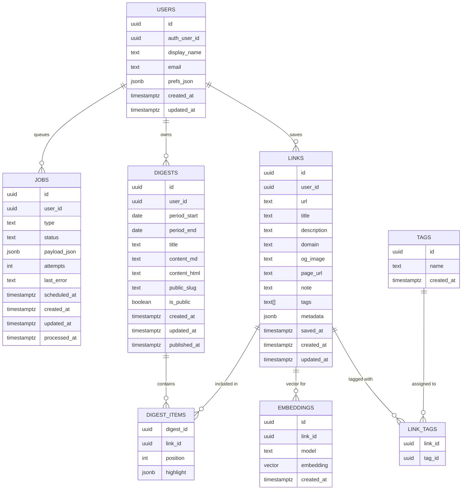

# アーキテクチャ概要

- **目的**

  - 気になった Web ページの URL を「ブラウザ拡張から一瞬で保存」して、あとから Web ダッシュボードで見返したり、将来は週次・月次ダイジェストにまとめられるようにする。
  - サーバーサイドは Go（Gin）、フロントは Next.js、データは Supabase/Postgres に集約する。

- **主要コンポーネント**
  - **ブラウザ拡張**（Chrome Manifest V3）
  - **API サーバー**（Go + Gin）
  - **Web アプリ**（Next.js）
  - **データベース**（Supabase / Postgres）

## コンポーネント構成

- **ブラウザ拡張（extension）**

  - スマホ：content script がページ上でリンクの「長押し」を検出し、小さな `Save` ボタンを表示。
  - PC：リンクの右クリックメニューに「Save link to QuickLinks（仮）」などのコンテキストメニュー項目を追加。
  - 上記いずれかの操作で以下のペイロードを API に送信：
    - `url`: 保存対象のリンク URL
    - `title`: リンクテキスト or ページタイトル
    - `page`: 保存操作をしたページの URL
    - `note`: 将来用に、選択テキスト等を載せられる余地
  - `fetch("{API_BASE}/api/links")` で JSON を POST。
  - ヘッダ `X-QuickLink-Secret` に共有シークレットを付与して、クローズドな環境でのみ利用する。

- **API サーバー（api, Go + Gin）**

  - エンドポイント（最小）：
    - `POST /api/links`
      - 拡張からのリンク保存リクエストを受け取る。
      - `X-QuickLink-Secret` を検証し、値が一致しない場合は `401 Unauthorized` を返す。
      - リクエストボディ（`url`, `title`, `note`, `page`, `user_identifier`）をバリデーション。
      - `url` から簡易的に `domain` を抽出。
      - `links` テーブルに 1 レコード挿入し、生成された `id` を返す。
    - （将来）`GET /api/links` などで Web アプリ向けの一覧取得 API を追加予定。
  - 構成イメージ：
    - `internal/config` … 環境変数（`PORT`, `DATABASE_URL`, `SHARED_SECRET`）の読み込み。
    - `internal/db` … Postgres（ローカル）または Supabase への接続プール管理、`InsertLink` などの簡易 DAO。
    - `internal/model` … `LinkCreateRequest` などのリクエスト / モデル定義。
    - `internal/handler` … Gin のハンドラ群（`CreateLink` など）。
    - `cmd/server/main.go` … HTTP サーバー起動、Graceful Shutdown。

- **Web アプリ（web, Next.js）**

  - 役割：
    - 保存されたリンクの一覧表示（ダッシュボード）。
    - 日付範囲 / ドメイン / タグなどによるフィルタ（段階的に追加）。
    - 将来的には、週次・月次ダイジェストの閲覧や共有ページのレンダリングもここで担当。
  - データ取得方法：
    - 開発初期は `NEXT_PUBLIC_API_BASE` 経由で Go API の `GET /api/links` から取得。
    - 必要に応じて、読み取り専用の Supabase anon key で DB から直接読む構成にも切り替え可能。
  - ページ構成（最小）：
    - `/` … 最近保存されたリンクのリストページ。
      - 各リンクの `title` / `url` / `domain` / `saved_at` を表示。
      - クリックで元ページへ遷移。

- **データベース（Supabase / Postgres）**
  - 本番：Supabase の Postgres（本番プロジェクト）を利用。
  - ローカル
    基本的に同じ Supabase プロジェクトに対して開発用テーブル / データを使う想定（接続文字列は `.env` で管理）。
    必要に応じて、開発用 Supabase プロジェクトに切り替えられるようにしておく。
  - 主なテーブル：
    - `links`
      - `id` (UUID, PK)
      - `user_identifier` (TEXT) … 拡張ごとの識別子 or 将来のユーザー ID
      - `url` (TEXT)
      - `title` (TEXT)
      - `description` (TEXT, 予備)
      - `domain` (TEXT)
      - `og_image` (TEXT)
      - `page_url` (TEXT)
      - `note` (TEXT)
      - `tags` (TEXT[])
      - `metadata` (JSONB)
      - `saved_at` / `created_at` (TIMESTAMPTZ)
    - `digests`
      - 週次・月次ダイジェスト用。`user_identifier`, 期間 (`period_start`, `period_end`), `content`, `public_slug` などを保持。

## データフロー

1. **リンク保存フロー**

   - ユーザーが任意の Web ページでリンクを長押し。
   - 拡張の content script がリンク要素を特定し、`Save` ボタンを表示。
   - ユーザーが `Save` を押すと、拡張が `{ url, title, page, note?, user_identifier? }` を含む JSON を `POST /api/links` に送信（`X-QuickLink-Secret` 付き）。
   - API サーバーがシークレットを検証し、DB にレコードを挿入。
   - 挿入結果の `id` を JSON で返し、拡張が「Saved」トーストを表示。

2. **ダッシュボード閲覧フロー**

   - ユーザーが Next.js Web アプリ（例：`http://localhost:3000`）にアクセス。
   - フロントエンドが初期ロード時に `GET {NEXT_PUBLIC_API_BASE}/api/links?limit=...` を叩き、最近のリンク一覧を取得。
   - 取得した配列を一覧表示し、リンククリックで元記事へジャンプ。
   - 将来的にはクエリパラメータで `from/to` などを指定して期間フィルタを行う。

3. **ダイジェスト生成フロー（将来拡張）**
   - バックエンド側で cron / ジョブキューを使い、週次・月次で `links` を集計。
   - AI API にタイトル / メタデータ / 抜粋を渡して要約を生成。
   - 生成した Markdown/HTML を `digests` テーブルに保存。
   - Web アプリが `/digests/{public_slug}` などで公開用ページを表示し、URL 共有できるようにする。

## 開発・デプロイ構成

- **ローカル開発**

  - API / Web はローカルで起動し、DB は Supabase（クラウド）に直接接続する。
    - `api`: Go/Gin サーバー（`DATABASE_URL` に Supabase の接続文字列を指定し、`SHARED_SECRET` を `.env` から読み込む）。
    - `web`: Next.js アプリ（`NEXT_PUBLIC_API_BASE` でローカル API の URL を参照）。
  - スキーマ変更は Supabase 側に対して実行する。誤って本番データを壊さないように、破壊的な変更は専用ブランチ or 開発用プロジェクトで試してから本番に反映する。

- **本番構成（イメージ）**
  - DB: Supabase（Postgres）。
  - API サーバー: コンテナ（Fly.io / Render / Railway など）もしくは Vercel Serverless Functions（要調整）。
  - Web アプリ: Vercel などに Next.js をデプロイ。
  - 拡張: Chrome Web Store などで配布（当面は共有シークレットでクローズド運用）。

## 今後の拡張の方向性（メモ）

- Supabase Auth と連携して、`user_identifier` をちゃんとしたユーザー ID に置き換える。
- OG 取得や本文スクレイピングをバックグラウンドジョブ化して、`links.metadata` を徐々にリッチにする。
- `digests` を定期生成するジョブと、ダイジェスト閲覧ページ（共有 URL）を Next.js で実装する。

## 将来的なデータモデル（ER 図）

将来的な完成形では、Supabase Auth と連携したユーザー管理やタグ、ダイジェスト項目、埋め込み、ジョブキューなどを含めた構成を想定する。



## 将来的なファイルツリー（完成系イメージ）

最終的に目指すモノレポ構成のイメージ。実際の実装時には細かいファイル名は変わる可能性があるが、レイヤー構造と責務の単位感を示す。

```text
personal-news/
  README.md
  package.json                # ルート共通ツール用（lint, format など）
  turbo.json / nx.json        # （任意）モノレポツール設定
  .gitignore
  .env.example

  infra/
    migrations/
      001_init_links.sql
      002_add_digests.sql
      003_add_tags_embeddings_jobs.sql
    supabase/
      schema.sql              # Supabase に流したいスキーマ定義
      seed_dev.sql            # 開発用シードデータ

  extension/
    manifest.json
    package.json
    tsconfig.json
    src/
      content-script.ts       # 長押し検出＋Saveボタン表示（モバイル向け）
      context-menu.ts         # 右クリックメニュー（PC向け）
      background.ts           # API 呼び出し、contextMenus の制御
      storage.ts              # 設定保存（API ベース URL など）
      ui/
        toast.ts              # 保存完了トースト
    icons/
    dist/                     # ビルド成果物

  api/                        # Go + Gin API サーバー
    go.mod
    go.sum
    Dockerfile
    .env.example
    cmd/
      server/
        main.go               # エントリポイント
    internal/
      config/
        config.go             # env 読み込み
      db/
        pg.go                 # pgx 接続プール
        migrate.go            # （任意）マイグレーション実行ヘルパ
      model/
        link.go               # Link / LinkCreateRequest
        digest.go             # Digest / DigestItem
        user.go
        tag.go
        job.go
      handler/
        links.go              # POST /api/links, GET /api/links
        digests.go            # 週次・月次ダイジェスト用 API
        health.go             # /health
      service/
        link_service.go       # ビジネスロジック（リンク登録など）
        digest_service.go     # ダイジェスト生成ロジック（AI 呼び出し含む）
      worker/
        queue.go              # ジョブキュー管理（Redis 等）
        jobs/
          fetch_og.go         # OG/メタデータ取得ジョブ
          summarize_week.go   # 週次ダイジェスト生成ジョブ
      util/
        logger.go
        http_error.go

  web/                        # Next.js アプリ
    package.json
    tsconfig.json
    next.config.js
    .env.local.example
    public/
      favicon.ico
    src/
      app/
        page.tsx              # 最近のリンク一覧
        links/
          page.tsx            # フィルタ付きリンク一覧
        digests/
          page.tsx            # 自分のダイジェスト一覧
          [slug].tsx          # 公開ダイジェスト表示
        api/
          proxy-links.ts      # （任意）API サーバーへの proxy
      components/
        layout/
          AppLayout.tsx
          Header.tsx
          Sidebar.tsx
        links/
          LinkList.tsx
          LinkItem.tsx
          LinkFilterBar.tsx
        digests/
          DigestCard.tsx
        ui/
          Button.tsx
          Spinner.tsx
          Badge.tsx
      lib/
        apiClient.ts          # API 呼び出しラッパ
        supabaseClient.ts     # Supabase クライアント（read 用）

  dev-scripts/
    run-api-local.sh
    run-web-local.sh
    sync-supabase-schema.sh

  .github/
    workflows/
      ci.yml                  # lint / test / build
      deploy-api.yml          # API デプロイ（任意）
      deploy-web.yml          # Web デプロイ（任意）
```
