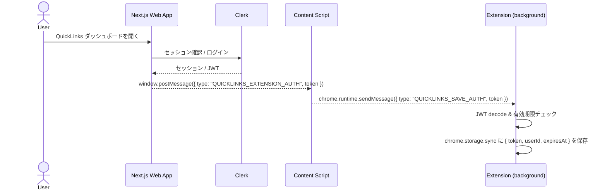
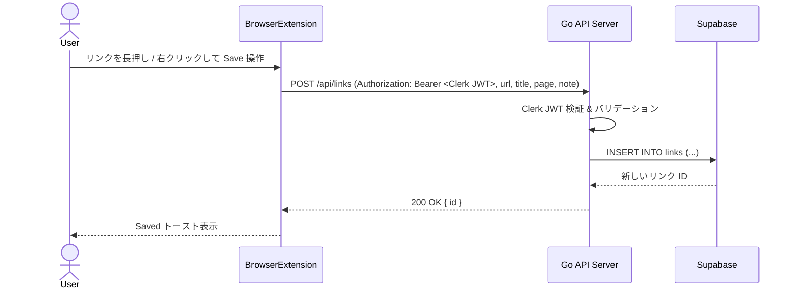
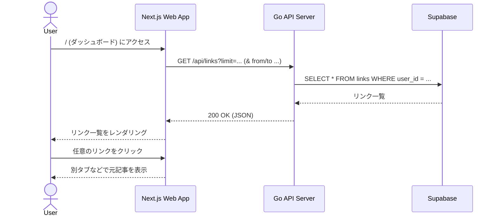
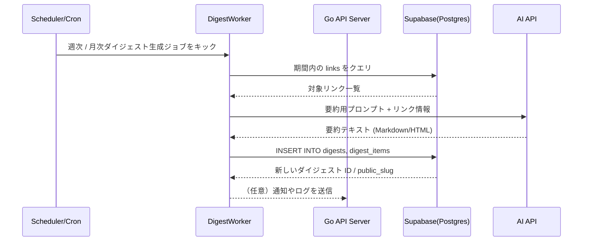

# アーキテクチャ概要

## 目的

気になった Web ページの URL を「ブラウザ拡張から一瞬で保存」して、あとから Web ダッシュボードで見返したり、将来は週次・月次ダイジェストにまとめられるようにする。

## 主要コンポーネント

| コンポーネント | ディレクトリ | 技術                |
| -------------- | ------------ | ------------------- |
| ブラウザ拡張   | /extension   | Chrome Manifest V3  |
| API サーバー   | /api         | Go + Gin            |
| Web アプリ     | /web         | Next.js             |
| データベース   |              | Supabase / Postgres |

## コンポーネント構成

### ブラウザ拡張（extension）

- スマホ：content script がページ上でリンクの「長押し」を検出し、小さな `Save` ボタンを表示。
- PC：リンクの右クリックメニューに「Save link to QuickLinks（仮）」などのコンテキストメニュー項目を追加。
- 上記いずれかの操作で以下のペイロードを API に送信：
  - `url`: 保存対象のリンク URL
  - `title`: リンクテキスト or ページタイトル
  - `page`: 保存操作をしたページの URL
  - `note`: 将来用に、選択テキスト等を載せられる余地
- 拡張はローカルに保存している Clerk の JWT を使って、`fetch("{API_BASE}/api/links")` に JSON を POST。
- HTTP ヘッダ `Authorization: Bearer <JWT>` を付与して認可を通す（共有シークレット方式は廃止）。
- Clerk JWT テンプレート: `quicklinks-extension`
  - カスタムクレームなし（`sub` を user_id として使用）
  - 有効期限: 7 日固定（仕様として継続運用）
  - 期限切れの場合は Web からの再同期で更新する
- Clerk の JWT は QuickLinks Web アプリへのログイン時に同期される。Web 側が `window.postMessage` でトークンをブラウザに投げ、拡張の content script → background がそれを受け取って `chrome.storage.sync` に保存する。
- 拡張側で独自のサインイン UI は持たず、Web ログイン済みであることを前提にトークン同期のみ行う。

### API サーバー（api, Go + Gin）

- エンドポイントは[API エンドポイント一覧](/documents/API_endpoints.md)を参照
- 構成イメージ：
  - `internal/config` … 環境変数（`PORT`, `DATABASE_URL`, `SHARED_SECRET`）の読み込み。
  - `internal/db` … Postgres（ローカル）または Supabase への接続プール管理、`InsertLink` などの簡易 DAO。
  - `internal/model` … `LinkCreateRequest` などのリクエスト / モデル定義。
  - `internal/handler` … Gin のハンドラ群（`CreateLink`, `GetLinks`, `GetOGP` など）。
  - `internal/service` … ビジネスロジック（`FetchMetadata` など、OGP 取得処理）。
  - `cmd/server/main.go` … HTTP サーバー起動、Graceful Shutdown。

### Web アプリ（web, Next.js）

- 役割：
  - 保存されたリンクの一覧表示（ダッシュボード）。
  - 日付範囲 / ドメイン / タグなどによるフィルタ（段階的に追加）。
  - 将来的には、週次・月次ダイジェストの閲覧や共有ページのレンダリングもここで担当。
- データ取得方法：
  - クライアント（useSWR）からは `/api/links` と `/api/og` を叩く。
  - **useSWR によるキャッシュ**: クライアントサイドでデータをキャッシュし、30 秒ごとに自動更新。
  - **OGP 情報の表示**: サムネイル画像、Description、公開日/更新日を表示（M3 で実装済み）。
    - 表示時に Go API の `/api/og` を呼び出してリアルタイムで OGP 情報を取得。
    - 各リンクカードが個別に OGP 情報を取得するため、非同期に読み込まれる。
    - 日付表示の優先順位: リアルタイム取得した日付 > DB の `published_at` > DB の `saved_at`。
- ページ構成（最小）：
  - `/` … 最近保存されたリンクのリストページ。
    - 各リンクの `title` / `url` / `domain` / `og_image` / `description` / `saved_at` を表示。
    - クリックで元ページへ遷移。

### データベース（Supabase / Postgres）

- 本番：Supabase の Postgres（本番プロジェクト）を利用。
- ローカル
  基本的に同じ Supabase プロジェクトに対して開発用テーブル / データを使う想定（接続文字列は `.env` で管理）。
  必要に応じて、開発用 Supabase プロジェクトに切り替えられるようにしておく。
- 主なテーブル（最小スキーマ）

  ```mermaid
  erDiagram
    links {
      id UUID PK
      user_identifier TEXT "Clerk の user_id or 将来の別ユーザー ID"
      url TEXT
      title TEXT
      description TEXT "予備"
      domain TEXT
      og_image TEXT
      page_url TEXT
      note TEXT
      tags TEXT[]
      metadata JSONB
      published_at TIMESTAMPTZ "記事の公開日/更新日（OGP から取得）"
      saved_at TIMESTAMPTZ
      created_at TIMESTAMPTZ
    }
  ```

  ```mermaid
  erDiagram
    digests {
      id UUID PK
      user_identifier TEXT "拡張ごとの識別子 or 将来のユーザー ID"
      period_start TIMESTAMPTZ
      period_end TIMESTAMPTZ
      content TEXT
      public_slug TEXT
      created_at TIMESTAMPTZ
    }
  ```

## コンポーネント図（クライアント ↔ 拡張 ↔ API ↔ DB）


## データフロー

### 1. 拡張と Web の認証同期フロー

- Clerk の「本当のログイン状態」は QuickLinks Web アプリ側が持ち、拡張はそれを後追いで同期する。
- ユーザーが Web ダッシュボードを開くと、Web は Clerk セッションから JWT を取得し、`window.postMessage` を通じて拡張に渡す。
- 拡張の content script がメッセージを受信し、`chrome.runtime.sendMessage` で background / 拡張本体に転送、JWT を `chrome.storage.sync` に保存する。
- 以降、拡張は `saveLink` などの API 呼び出し時に、この JWT を `Authorization: Bearer ...` として再利用する。



### 2. リンク保存フロー

- ユーザーが任意の Web ページでリンクを長押し。
- 拡張の content script がリンク要素を特定し、`Save` ボタンを表示。
- ユーザーが `Save` を押すと、拡張が `{ url, title, page, note?, user_identifier? }` を含む JSON を `POST /api/links` に送信（`Authorization: Bearer <Clerk JWT>`）。
- API サーバーが JWT を検証し、DB にレコードを挿入。
- 挿入結果の `id` を JSON で返し、拡張が「Saved」トーストを表示。



### 3. ダッシュボード閲覧フロー

- ユーザーが Next.js Web アプリ（例：`http://localhost:3000`）にアクセス。
- フロントエンドが初期ロード時に `GET {NEXT_PUBLIC_API_BASE}/api/links?limit=...` を叩き、最近のリンク一覧を取得。
- 取得した配列を一覧表示し、リンククリックで元記事へジャンプ。
- 将来的にはクエリパラメータで `from/to` などを指定して期間フィルタを行う。



### 4. ダイジェスト生成フロー（将来拡張）

- バックエンド側で cron / ジョブキューを使い、週次・月次で `links` を集計。
- AI API にタイトル / メタデータ / 抜粋を渡して要約を生成。
- 生成した Markdown/HTML を `digests` テーブルに保存。
- Web アプリが `/digests/{public_slug}` などで公開用ページを表示し、URL 共有できるようにする。



## 開発・デプロイ構成

- **ローカル開発**

  - API / Web はローカルで起動し、DB は Supabase（クラウド）に直接接続する。
    - `api`: Go/Gin サーバー（`DATABASE_URL` に Supabase の接続文字列を指定し、Clerk 関連の設定値を `.env` から読み込む）。
    - `web`: Next.js アプリ（`NEXT_PUBLIC_API_BASE` でローカル API の URL を参照）。
  - スキーマ変更は Supabase 側に対して実行する。誤って本番データを壊さないように、破壊的な変更は専用ブランチ or 開発用プロジェクトで試してから本番に反映する。

  - **本番構成（イメージ）**
  - DB: Supabase（Postgres）。
  - API サーバー: コンテナ（Fly.io / Render / Railway など）もしくは Vercel Serverless Functions（要調整）。
  - Web アプリ: Vercel などに Next.js をデプロイ。
  - 拡張: Chrome Web Store などで配布（Clerk ログイン必須のクローズド運用）。

## 今後の拡張の方向性（メモ）

- OG 取得や本文スクレイピングをバックグラウンドジョブ化して、`links.metadata` を徐々にリッチにする。
- `digests` を定期生成するジョブと、ダイジェスト閲覧ページ（共有 URL）を Next.js で実装する。
