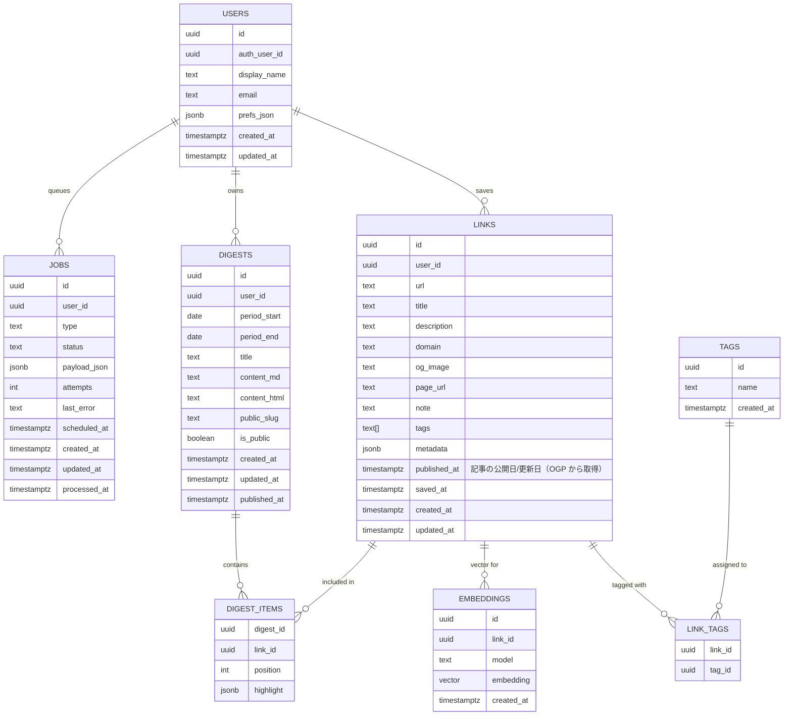

# 将来的なデータモデル（ER 図）

将来的な完成形では、Supabase Auth と連携したユーザー管理やタグ、ダイジェスト項目、埋め込み、ジョブキューなどを含めた構成を想定する。

```mermaid
erDiagram
  USERS ||--o{ LINKS : "saves"
  USERS ||--o{ DIGESTS : "owns"
  USERS ||--o{ JOBS : "queues"

  LINKS ||--o{ LINK_TAGS : "tagged with"
  TAGS ||--o{ LINK_TAGS : "assigned to"

  LINKS ||--o{ EMBEDDINGS : "vector for"

  DIGESTS ||--o{ DIGEST_ITEMS : "contains"
  LINKS ||--o{ DIGEST_ITEMS : "included in"

  USERS {
    uuid id
    uuid auth_user_id
    text display_name
    text email
    jsonb prefs_json
    timestamptz created_at
    timestamptz updated_at
  }

  LINKS {
    uuid id
    uuid user_id
    text url
    text title
    text description
    text domain
    text og_image
    text page_url
    text note
    text[] tags
    jsonb metadata
    timestamptz published_at "記事の公開日/更新日（OGP から取得）"
    timestamptz saved_at
    timestamptz created_at
    timestamptz updated_at
  }

  TAGS {
    uuid id
    text name
    timestamptz created_at
  }

  LINK_TAGS {
    uuid link_id
    uuid tag_id
  }

  DIGESTS {
    uuid id
    uuid user_id
    date period_start
    date period_end
    text title
    text content_md
    text content_html
    text public_slug
    boolean is_public
    timestamptz created_at
    timestamptz updated_at
    timestamptz published_at
  }

  DIGEST_ITEMS {
    uuid digest_id
    uuid link_id
    int position
    jsonb highlight
  }

  EMBEDDINGS {
    uuid id
    uuid link_id
    text model
    vector embedding
    timestamptz created_at
  }

  JOBS {
    uuid id
    uuid user_id
    text type
    text status
    jsonb payload_json
    int attempts
    text last_error
    timestamptz scheduled_at
    timestamptz created_at
    timestamptz updated_at
    timestamptz processed_at
  }
```
